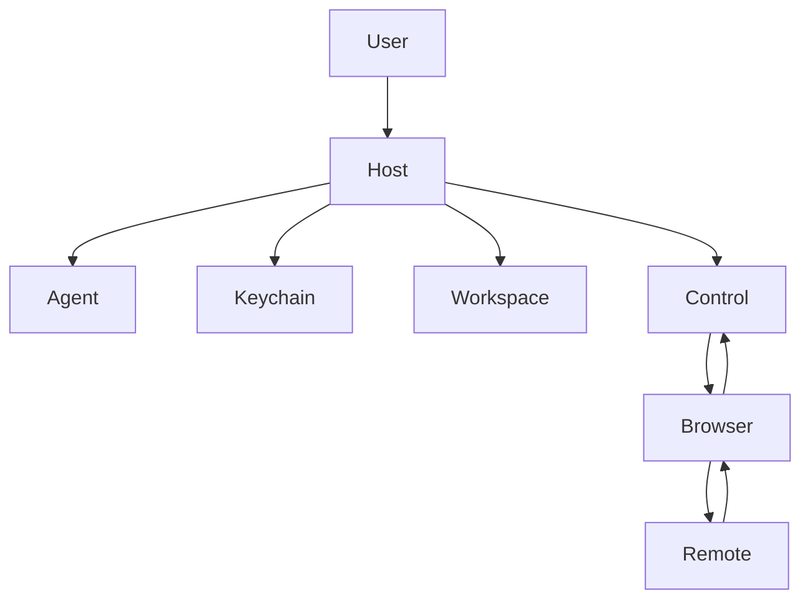

# OMP Browser Security Boundary — Threat Model

> **Status:** Internal engineering decision record (AGE-647 / ZED-10). Not part of
> the published end-user book; intentionally omitted from `SUMMARY.md` (as is the
> capability audit it builds on).
>
> **This document is a prerequisite gate.** A running browser/webview surface is
> AGE-650. Per that issue and the capability audit, the browser panel **must not
> be implemented until a human security review ratifies the boundary specified
> here** (§9). This document defines the *only acceptable* boundary; it ships no
> executable web surface.

## 1. Executive summary

Ompzed has **no embedded web-content surface today** — no webview, no browser
engine, no JavaScript execution, no Chromium/CDP integration, and no
renderer→host bridge. A repository search for the usual embedding crates
(`wry`, `cef`, `tao`, `servo`, `chromiumoxide`, `webview`) returns **zero**
dependencies in any `crates/*/Cargo.toml`; the only HTML-touching code converts
or renders *static, already-fetched* markup as native text and never executes a
page (§7). The feature is therefore off by default in the strongest possible
sense: the attack surface does not exist yet.

This is the moment to fix the boundary, because the capability audit
(`docs/src/omp/extension-capability-audit.md`, rows "Browser / webview",
AGE-647, AGE-650) already rules that embedded web content **must be fork-native,
in an isolated renderer process, with a navigation/host allow-list, page content
treated as untrusted, and no script→host bridge that exposes credentials, the
OS, or subprocess spawn.** GPUI has no native webview primitive, so the renderer
is necessarily out-of-process — the same isolation shape the existing OMP agent
already uses (`crates/agent_servers/src/omp.rs` spawns the agent as a separate
child over stdio).

The dominant risks are all variants of *untrusted remote content reaching a
privileged host asset*: keychain credentials (GitHub via `gh`, the Linear API
key from AGE-646), workspace files, the OMP agent control channel, and the
host's ability to spawn subprocesses. Every one is mitigated by the same small
set of invariants: **process isolation, no preload/bridge/Node, an http(s)-only
navigation allow-list, ephemeral storage by default, and no agent-driven
browser control.** The threat table (§8) and the normative boundary spec (§10)
make those invariants testable acceptance criteria for AGE-650.

## 2. Scope and assumptions

**In scope:** the trust boundary between (a) the Ompzed/GPUI host process and
the OMP agent it controls, and (b) any future embedded browser surface and the
remote web content it loads.

**Out of scope:** the OMP agent's own tool-approval model (covered by AGE-640),
the GitHub/Linear read-only bridges (AGE-649/AGE-646; they perform no script
execution), and the security of remote sites themselves.

**Assumptions** (pinned by the AGE-647 issue; stated rather than re-validated):

- A-1: Ompzed is a **desktop application** running with the user's full OS
  privileges. A compromise that reaches host code execution is total.
- A-2: The valuable assets are **local**: OS-keychain credentials, workspace
  files, and the OMP agent/subprocess capability — not a server-side database.
- A-3: The **attacker is malicious remote web content** (HTML/CSS/JS) that the
  user navigates to, or that a page auto-loads (ads, iframes, redirects), inside
  the future browser surface. The attacker fully controls that content.
- A-4: GPUI exposes **no in-process webview**; any browser engine is a separate
  OS process. This is a constraint, and conveniently also the desired boundary.
- A-5: The browser feature is **user-initiated and off by default**; the OMP
  agent does not silently drive it.

## 3. System model

### 3.1 Primary components

| Component | Trust | Exists today? | Evidence |
|---|---|---|---|
| Ompzed host process (GPUI app, agent panel) | Trusted | Yes | `crates/gpui`, `crates/agent_ui/src/agent_ui.rs` |
| OMP agent child process | Semi-trusted (user's agent; separate process over stdio) | Yes | `crates/agent_servers/src/omp.rs` (spawn ~`OmpSessionState::spawn`) |
| OS keychain (credentials) | Trusted store | Yes | `crates/gpui/src/app.rs` `read_credentials`/`write_credentials`; `crates/agent_servers/src/linear_context.rs` |
| Workspace / project files | Trusted data | Yes | `crates/project` (`visible_worktrees`, worktree `abs_path`) |
| **Browser renderer process** | **Untrusted host for untrusted content** | **No (AGE-650)** | — proposed by this doc |
| **Host↔browser control channel** | **Trust boundary** | **No (AGE-650)** | — proposed by this doc |
| Remote web content (page JS) | **Fully untrusted** | No | — loaded by the future renderer |

### 3.2 Data flows and trust boundaries

- **TB-1 — Host ↔ Browser process.** A process boundary. The host may send the
  renderer *navigation intents and lifecycle commands only*. The renderer must
  expose **no** API back to the host beyond coarse status (title/url/loading),
  and must never receive host secrets in its environment or arguments.
- **TB-2 — Browser process ↔ Remote content.** The renderer's own sandbox. All
  page script is untrusted; it must be unable to escape the renderer or reach
  TB-1's host side.
- **TB-3 — Host process ↔ Privileged assets.** The host alone holds keychain
  access, the OMP agent stdio, workspace file handles, and subprocess spawn.
  None of these may be reachable across TB-1 from the renderer.

The single defended chokepoint is `Control` (TB-1): everything to its left is
trusted host territory holding the assets; everything from `Browser` rightward is
untrusted. `Remote` content must never traverse `Control` back into `Host`.

## 4. Assets

| ID | Asset | Why it matters | Evidence |
|---|---|---|---|
| AS-1 | OS-keychain credentials (GitHub `gh` token, Linear API key) | Account takeover; data exfiltration | `crates/agent_servers/src/linear_context.rs` (keychain url `https://api.linear.app`); `crates/gpui/src/app.rs` credential APIs |
| AS-2 | Workspace / project file contents | Source/secret leakage; tampering | `crates/project` worktree access |
| AS-3 | OMP agent control channel (stdio) | Arbitrary agent actions; tool abuse | `crates/agent_servers/src/omp.rs` |
| AS-4 | Host subprocess-spawn / filesystem capability | Local code execution; persistence | `crates/agent_servers/src/omp.rs` spawn; `crates/util/src/command.rs` |
| AS-5 | Browser session state (cookies/localStorage, if persisted) | Session theft; cross-site tracking | — future renderer storage |
| AS-6 | Host process integrity (memory, address space) | Full compromise | `crates/gpui` |

## 5. Attacker model

**The attacker controls remote web content fully.** Within the future browser
surface they can:

- C-1: Serve arbitrary HTML/CSS/**JavaScript** and run it in the renderer.
- C-2: Attempt navigation to any URL or scheme (`http(s)`, `file:`, `app:`,
  custom `zed:`-like schemes, `javascript:`).
- C-3: Open popups / `window.open`, trigger redirects and auto-loaded iframes.
- C-4: Issue network requests from the page (`fetch`, WebSocket), including to
  `localhost`/RFC-1918 addresses (SSRF-style probing).
- C-5: Attempt to read/write storage and to reach other origins' storage.
- C-6: Attempt to invoke any IPC/bridge/preload the embedder exposes.
- C-7: Attempt to exploit a renderer/engine memory-safety bug (0-day).
- C-8: Phish — render convincing UI imitating Ompzed or a login page.

**The attacker must NOT be able to** (these are the boundary's goals):

- N-1: Execute code in the **host** process.
- N-2: Read or write the **keychain** (AS-1).
- N-3: Read/write **workspace files** (AS-2) or any host filesystem path.
- N-4: Reach the **OMP agent** channel (AS-3) or **spawn subprocesses** (AS-4).
- N-5: Persist state beyond the session unless the user explicitly opted into a
  persistent partition (AS-5).
- N-6: Be **driven by the agent** without user initiation.

## 6. Entry points

| ID | Entry point | Default posture |
|---|---|---|
| EP-1 | URL navigation (typed or link/redirect) | `http(s)` allow-list only |
| EP-2 | Page JavaScript execution in renderer | Allowed *inside* the sandbox; no host reach |
| EP-3 | Popups / `window.open` / target=_blank | Denied or routed to host-mediated open |
| EP-4 | Non-`http(s)` schemes (`file:`, `javascript:`, custom) | Blocked |
| EP-5 | Storage (cookies / localStorage / IndexedDB) | Ephemeral per-session partition |
| EP-6 | Downloads | Disabled or host-mediated, user-confirmed |
| EP-7 | Host↔renderer control channel (TB-1) | Host→renderer commands only; no page-exposed bridge |

## 7. Source proof — current state

The acceptance criterion "prototype/source proof confirms remote content cannot
access OMP/Zed privileged APIs" is satisfied today by **absence of surface**,
and going forward by the boundary spec (§10). Evidence:

1. **No web-embedding dependency exists.** Searching every `crates/*/Cargo.toml`
   for `wry`, `cef`, `tao`, `servo`, `chromiumoxide`, `webview`, `headless_chrome`
   returns no matches. The only `chromium`/`servo` hits in the tree are a Gerrit
   URL parser (`crates/git_hosting_providers/src/providers/chromium.rs`) and
   source-comment citations in GPUI platform code (e.g.
   `crates/gpui_macos/src/dispatcher.rs`) — neither embeds web content.
2. **No live web content is rendered.** The only HTML-touching code is
   `crates/html_to_markdown` (parses HTML into text/markdown) and
   `crates/markdown/src/html/html_rendering.rs` (renders *sanitized, already
   converted* markdown HTML blocks as native GPUI text elements). Neither
   executes JavaScript, loads remote pages, or instantiates a webview.
3. **Therefore there is no page→host channel** because there is no page surface,
   and **no browser feature/crate to enable** — "off by default" is structural,
   not a runtime flag.

This is the baseline the boundary must preserve when AGE-650 introduces a real
surface: any new page→host path is a regression against this model.

## 8. Threat model

Likelihood/Impact/Priority assume the future browser surface exists and is
loading attacker-controlled content. "Existing controls" reflect today's
absence-of-surface; "Recommended mitigations" are the AGE-650 acceptance bar.

| ID | Threat source | Prerequisites | Threat action | Impact | Impacted assets | Existing controls | Gaps | Recommended mitigations | Detection | Likelihood | Impact severity | Priority |
|---|---|---|---|---|---|---|---|---|---|---|---|---|
| TM-001 | Malicious page JS | An embedder-exposed preload/bridge/IPC reachable from the page | Call a host API to read the keychain / drive the agent | Credential theft; agent abuse | AS-1, AS-3, AS-4 | No surface today | A bridge could be added with the panel | **No preload, no Node integration, no message channel callable by the page**; renderer exposes nothing host-side (TB-1) | Code review of the control channel; assert no page-exposed handlers | Medium | Critical | **Critical** |
| TM-002 | Malicious page / link | Renderer follows non-`http(s)` schemes | Navigate to `file://`, `javascript:`, or a custom `zed:`-style scheme to read files or hit a host handler | Local file read; host handler invocation | AS-2, AS-6 | No surface today | — | **http(s)-only navigation allow-list**; block `file:`/`javascript:`/custom schemes; canonicalize before allow-check | Log + reject blocked-scheme navigations | High | High | **High** |
| TM-003 | Renderer engine 0-day | Memory-safety bug in the browser engine | Achieve RCE in renderer, attempt sandbox escape to host | Host compromise | AS-6, all | No surface today | — | **Out-of-process renderer with OS sandbox**, least privilege, **no host secrets in its env/args**; keep engine patched | Process/crash monitoring; engine version pinning | Low | Critical | **High** |
| TM-004 | Malicious page | Persistent storage partition shared/default-on | Plant long-lived cookies/localStorage; track across sessions; steal another origin's storage | Session theft; tracking | AS-5 | No surface today | — | **Ephemeral per-session partition by default**; persistence is explicit, per-profile, isolated by origin | Audit partition config | Medium | Medium | **Medium** |
| TM-005 | Malicious page | `window.open`/popup allowed | Spawn popups / fullscreen / spoofed chrome to phish for the user's credentials | Credential phishing | AS-1 | No surface today | — | **Deny popups or route to host-mediated, user-confirmed open**; never grant page-controlled chrome | Count/intercept popup attempts | Medium | High | **High** |
| TM-006 | Malicious page | Page can issue arbitrary `fetch`/WebSocket | SSRF-style probing of `localhost`/RFC-1918, including the OMP agent or local services | Internal service access; data exfil | AS-3, AS-2 | No surface today (agent stdio is not a network port) | — | Treat page network as untrusted; **bind no privileged service to a page-reachable port**; consider blocking local-address fetches | Network egress monitoring | Medium | Medium | **Medium** |
| TM-007 | Compromised/over-eager agent | Agent able to drive the browser | Auto-navigate to attacker URL or weaponize the browser as a confused deputy | Drive-by; SSRF via host | AS-3, AS-6 | No surface today; agent has no browser API | — | **No agent→browser auto-control**; browser is user-initiated only; any agent navigation requires explicit user approval (reuse AGE-640 approval) | Audit agent→browser calls (none should exist) | Low | High | **Medium** |
| TM-008 | Malicious download | Downloads enabled | Deliver an executable/script to a predictable path and entice execution | Local code execution | AS-4, AS-6 | No surface today | — | **Disable downloads, or host-mediate with explicit user confirmation** and a non-executable quarantine dir | Log download attempts | Low | High | **Medium** |
| TM-009 | Malicious page | Renderer leaks host context via titles/URLs/errors | Smuggle data through the coarse status channel (title/url) back toward host logging | Limited info leak | AS-6 | No surface today | — | Treat status strings as untrusted; **never `eval`/interpret renderer-supplied strings**; size-bound and sanitize before logging | Review status-handling code | Low | Low | **Low** |

## 9. Criticality calibration

- **Critical:** TM-001 (script→host bridge). This is the single most important
  invariant; if violated, every host asset falls. The boundary's first rule is
  *there is no bridge.*
- **High:** TM-002 (scheme escape), TM-003 (renderer RCE → sandbox escape),
  TM-005 (popup phishing). Each is a well-trodden attack on embedded browsers.
- **Medium:** TM-004 (storage), TM-006 (SSRF), TM-007 (agent confused deputy),
  TM-008 (downloads).
- **Low:** TM-009 (status-channel info leak).

The ranking deliberately weights *reachability of host privilege* over page-only
impact, per assumption A-1 (a host compromise on a desktop app is total).

## 10. Boundary specification (normative for AGE-650)

AGE-650 **must** satisfy all of the following; each maps to threats above and is
intended to be a testable acceptance criterion. These are MUST/MUST-NOT
requirements, not suggestions.

1. **Process isolation (TM-001, TM-003).** The renderer runs as a **separate OS
   process** with no shared address space with the host, mirroring the
   out-of-process model in `crates/agent_servers/src/omp.rs`. The renderer
   process is launched with least privilege and **must not** inherit host
   secrets via environment or arguments.
2. **No bridge / no preload / no Node (TM-001).** The embedder exposes **no**
   preload script, no Node integration, and **no** IPC channel that page
   JavaScript can call. The control channel (TB-1) carries host→renderer
   navigation/lifecycle commands and coarse renderer→host status only; it
   exposes no keychain, filesystem, agent, or subprocess capability.
3. **http(s)-only navigation allow-list (TM-002).** Navigation is restricted to
   `http`/`https`. `file:`, `javascript:`, `data:` top-level, and all custom
   schemes are blocked. URLs are canonicalized before the allow-check.
4. **Popups denied or host-mediated (TM-005).** `window.open`/`target=_blank`
   are denied by default, or routed to a host-mediated, user-confirmed open;
   the page never controls window chrome.
5. **Ephemeral storage by default (TM-004).** Cookies/localStorage/IndexedDB
   live in an **ephemeral per-session partition**; any persistent partition is
   explicit, opt-in, and origin-isolated.
6. **Downloads disabled or host-mediated (TM-008).** Off by default; if enabled,
   user-confirmed into a non-executable quarantine location.
7. **No agent auto-control (TM-007).** The browser is **user-initiated**. The
   OMP agent has no API to navigate or script it; any future agent navigation
   must route through the existing user-approval flow (AGE-640).
8. **Untrusted status handling (TM-009).** Renderer-supplied strings
   (title/url/errors) are treated as untrusted: never interpreted/`eval`'d,
   size-bounded, and sanitized before logging or display.
9. **Off by default (acceptance).** The feature ships disabled; enabling it is an
   explicit user action.
10. **HITL gate.** A human security reviewer must sign off on the AGE-650
    implementation against requirements 1–9 before it merges.

## 11. Focus paths for the HITL review

When AGE-650 is implemented, the reviewer should concentrate on:

- The **control channel definition** (TB-1): enumerate every message the page or
  renderer can send toward the host and confirm none exposes AS-1..AS-4. This is
  the TM-001 chokepoint.
- The **navigation allow-list enforcement** point: confirm canonicalization
  happens before the scheme/host check and cannot be bypassed by redirects or
  encoded URLs (TM-002).
- The **renderer process launch**: confirm no host secrets in env/args and that
  the OS sandbox is actually engaged (TM-003).
- The **storage partition configuration**: confirm ephemeral default (TM-004).
- A grep proving **no agent→browser navigation API** exists (TM-007).

## 12. Open questions (to resolve in AGE-650 design, not here)

- Which engine hosts the renderer (system WebView vs. bundled Chromium via CDP
  vs. another out-of-process embedder), and does its sandbox satisfy
  requirement 1 on every target OS?
- Whether any first-party (trusted) pages warrant a relaxed allow-list, and if
  so how trust is established without weakening TM-002.
- The exact UX for user-initiated navigation and popup/download confirmation,
  reusing the AGE-640 approval widgets where possible.
